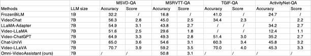

# Omni-VideoAssistant
Author Shihao Wang and Dongyang Yu and Wangpeng An

We will release Training and Dataset soon.

## 🔨 Preparation
```bash
git clone https://github.com/wanghao-cst/Omni-VideoAssistant
cd Omni-VideoAssistant
```
```shell
conda create -n omni python=3.10 -y
conda activate omni
pip install --upgrade pip
pip install -e .
```

## 🌟 Start here
### Download Omni Preview Model
[Omni Preview Model 5.3](https://huggingface.co/harvey2333/omni_video_assistant_5_3)

### Inference in Gradio Web UI
```bash
python -m  llava.serve.gradio_web_server
```

link 2 video

### Inference in CLI
```
CUDA_VISIBLE_DEVICES=0 python -m llava.eval.run_omni \
    --model-path "path to omni checkpoints" \
    --image-file "llava/serve/examples/extreme_ironing.jpg" \
    --query "What is unusual about this image?" \
    --image-aspect-ratio "pad"
CUDA_VISIBLE_DEVICES=0 python -m llava.eval.run_omni \
    --model-path path to omni checkpoints \
    --video-file "llava/serve/examples/0A8CF.mp4" \
    --query "Describe the activity in the video" \
    --image-aspect-ratio "pad"
```

## Results Comparision
### Image understanding
<p align="left">

</p>

### Video understanding
<p align="left">

</p>


## 😊 Acknowledgment

This work is based on [MVCE](https://github.com/shajiayu1/MVCE/), [LLaVA](https://github.com/haotian-liu/LLaVA/)
