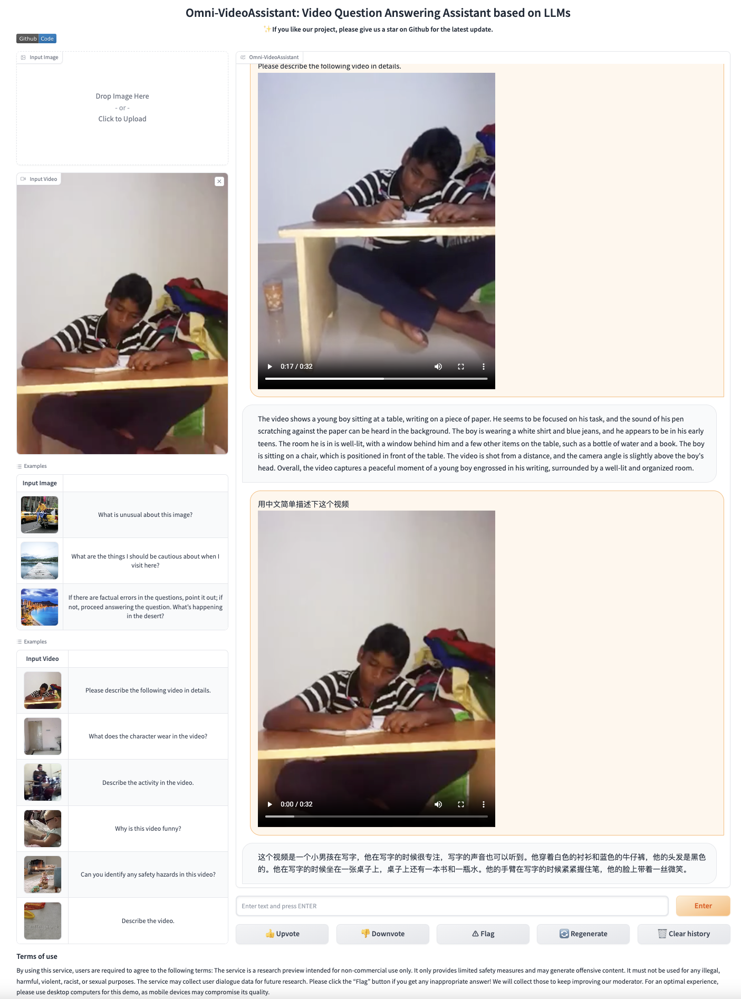
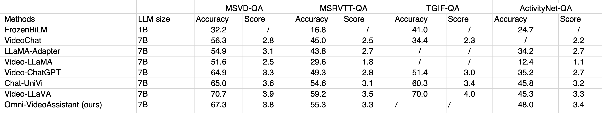

# Omni-VideoAssistant
Training and Dataset will be released soon.
A more powerful model is on the way.
We also provide the [online demo](https://de973ccc16ab3cbd1d.gradio.live).

## 📝 Updates
* **[2023.12.09]**  🤗[Hugging Face](https://huggingface.co/harvey2333/omni_video_assistant_6_1) **A Better Model V6.1** are available now! Welcome to **watch** this repository for the latest updates.
* **[2023.12.06]**  Gradio & CLI **Inference Demo** are available now.
* **[2023.12.01]**  🤗[Hugging Face](https://huggingface.co/harvey2333/omni_video_assistant_5_3) **Preview Model** are available now!

<details open><summary>💡 I also have other video-language projects that may interest you ✨. </summary><p>
<!--  may -->

> [**OmniDataComposer: A Unified Data Structure for Multimodal Data Fusion and Infinite Data Generation**](https://arxiv.org/abs/2308.04126) <br>
> Dongyang Yu, Shihao Wang, Yuan Fang, Wangpeng An <br>
[](https://github.com/shajiayu1/MVCE/) [](https://arxiv.org/abs/2308.04126) <br></p></details>


## 🔨 Preparation
```bash
git clone https://github.com/wanghao-cst/Omni-VideoAssistant
cd Omni-VideoAssistant
```
```shell
conda create -n omni python=3.10 -y
conda activate omni
pip install --upgrade pip
pip install -e .
```

## 🌟 Start here
### Download Omni Preview Model
Download for CLI inference only, gradio web UI will download it automatically. Before switch to other video or image, please click "Clear history" first. Otherwise, it will generate answer related to the last input.
[Omni Preview Model 6.1](https://huggingface.co/harvey2333/omni_video_assistant_6_1)

### Inference in Gradio Web UI

```Shell
CUDA_VISIBLE_DEVICES=0 python -m  llava.serve.gradio_demo
```
<p align="left">

</p>

### Inference in CLI
```
CUDA_VISIBLE_DEVICES=0 python -m llava.eval.run_omni \
    --model-path "path to omni checkpoints" \
    --image-file "llava/serve/examples/extreme_ironing.jpg" \
    --query "What is unusual about this image?"
CUDA_VISIBLE_DEVICES=0 python -m llava.eval.run_omni \
    --model-path "path to omni checkpoints" \
    --video-file "llava/serve/examples/0A8CF.mp4" \
    --query "Describe the activity in the video"
```

## 🔥 Results Comparison
### Image understanding
<p align="left">

</p>

### Video understanding
<p align="left">

</p>


## 😊 Acknowledgment

This work is based on [MVCE for unlimited training data generation.](https://github.com/shajiayu1/MVCE/), [LLaVA for pretrained model](https://github.com/haotian-liu/LLaVA/)
